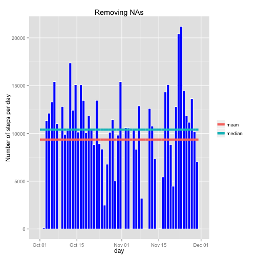
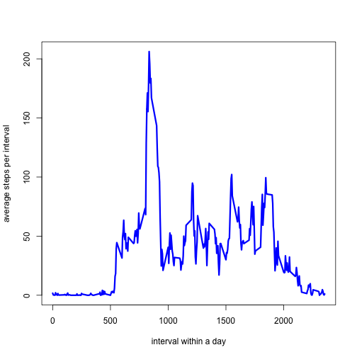
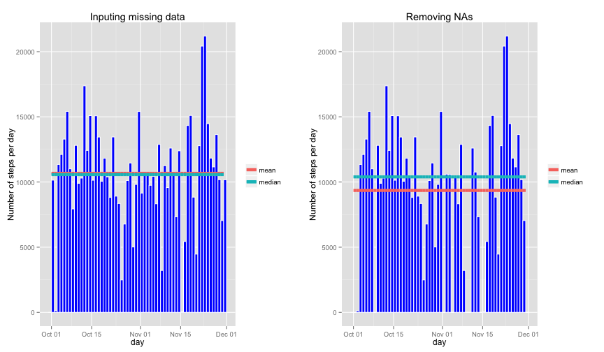
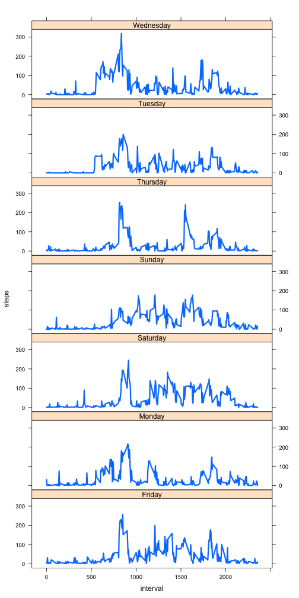
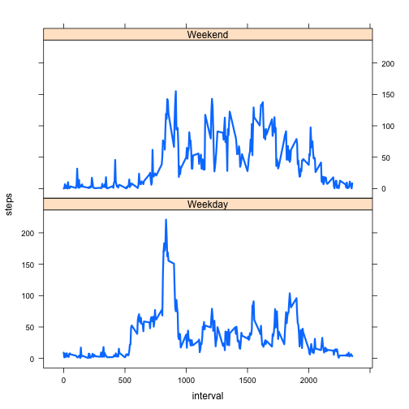

# Reproducible Research: Peer Assessment 1
==========================================


## Loading and preprocessing the data

We first load the data and convert the dates to a date format


```r
activity_data = read.csv("activity.csv")
activity_data$date <- as.Date(activity_data$date)
head(activity_data)
```

```
##   steps       date interval
## 1    NA 2012-10-01        0
## 2    NA 2012-10-01        5
## 3    NA 2012-10-01       10
## 4    NA 2012-10-01       15
## 5    NA 2012-10-01       20
## 6    NA 2012-10-01       25
```


## What is mean total number of steps taken per day?

We compute the mean and the median of the number of steps per day


```r
steps_per_day <- aggregate(activity_data$steps, by = list(activity_data$date), 
    FUN = sum, na.rm = TRUE)
colnames(steps_per_day) <- c("date", "steps")
mean <- mean(steps_per_day$steps)
median <- median(steps_per_day$steps)
```

The mean is 9354.2 steps per day and the median is 10395.0 steps per day. We then plot the total number of steps per day with its mean and median


```r
library("ggplot2")
plot_before <- qplot(date, weight = steps, data = activity_data, ylab = "Number of steps per day", 
    xlab = "day", na.rm = TRUE, main = "Removing NAs", binwidth = 1) + geom_bar(color = "white", 
    fill = "blue", binwidth = 1) + geom_line(aes(y = mean, colour = "mean"), 
    size = 2) + geom_line(aes(y = median, colour = "median"), size = 2) + theme(legend.title = element_blank())
print(plot_before)
```

 


## What is the average daily activity pattern?

We can look now at the 5-minute interval (x-axis) and the average number of steps taken, averaged across all days (y-axis). We compute the mean for each interval and the total mean:


```r
average_steps_per_interval <- aggregate(activity_data$step, by = list(activity_data$interval), 
    FUN = mean, na.rm = TRUE)
colnames(average_steps_per_interval) <- c("interval", "steps")
```


and plot the corresponding time series


```r
plot(average_steps_per_interval$interval, average_steps_per_interval$steps, 
    type = "l", col = "blue", lwd = 3, xlab = "interval within a day", ylab = "average steps per interval")
```

 

```r
max <- max(average_steps_per_interval$steps)
interval_for_max <- average_steps_per_interval$interval[which.max(average_steps_per_interval$steps)]
time <- strftime(strptime(paste("0", as.character(interval_for_max), sep = ""), 
    "%H%M"), format = "%H:%M %p")
```


The curve clearly pick around a maximum value 206.2 of steps per interval for the interval 835 (or for time 08:35 AM).

## Imputing missing values

We look now at the missing values. There are 2304 missing values for the steps for 17568 total entries which is 13.1% of missing values. We will imput the missing data using the total mean. Because inputing data with the same mean will bias the standard deviation we can add an error factor drawn from a log-normal distribution with the same standard deviation (to be sure that the values are not negative). the log-normal random generator takes 2 paramaters $\mu$ and $\sigma$ that can be derived from the mean $m$ and the variance $v$ of the distribution:
$$
\begin{eqnarray}
\mu &=& \log(\frac{m^2 }{ \sqrt{v+m^2} } )\\
\sigma &=& \sqrt{\log(\frac{v}{m^2}+1) }
\end{eqnarray}
$$


```r
variance_before <- var(activity_data$steps, na.rm = TRUE)
mean_before <- mean(activity_data$steps, na.rm = TRUE)
na_index <- which(is.na(activity_data$steps))
set.seed(1000)
mu <- log(mean_before^2/sqrt(variance_before + mean_before^2))
sigma <- sqrt(log(variance_before/mean_before^2 + 1))
for (index in na_index) {
    activity_data$steps[index] = rlnorm(1, meanlog = mu, sdlog = sigma)
}

variance_after <- var(activity_data$steps, na.rm = TRUE)
mean_after <- mean(activity_data$steps, na.rm = TRUE)
```

We can then compare the variance before 1.2543 &times; 10<sup>4</sup> and after 1.1636 &times; 10<sup>4</sup> which seem to aggree within statistical error. Similarly, we observe  the mean before 37.3826 and after 37.0558 which seem to aggree.

We can now recompute the histogram of the mean total number of steps taken per day (we include also the previous plot for comparison)


```r
steps_per_day <- aggregate(activity_data$steps, by = list(activity_data$date), 
    FUN = sum, na.rm = TRUE)
colnames(steps_per_day) <- c("date", "steps")
mean2 <- mean(steps_per_day$steps)
median2 <- median(steps_per_day$steps)

library("ggplot2")
library("grid")
library("gridExtra")
plot_after <- qplot(date, weight = steps, data = activity_data, ylab = "Number of steps per day", 
    xlab = "day", main = "Inputing missing data", na.rm = TRUE, binwidth = 1) + 
    geom_bar(color = "white", fill = "blue", binwidth = 1) + geom_line(aes(y = mean2, 
    colour = "mean"), size = 2) + geom_line(aes(y = median2, colour = "median"), 
    size = 2) + theme(legend.title = element_blank())
```


```r
grid.arrange(plot_after, plot_before, ncol = 2, widths = c(14, 14))
```

 

The scheme has biased the mean and the median per day. We have 10672.1 against 9354.2 previously for the mean and we have 10571.0 against 10395.0 previously for the median. The mean and median appear now superimposed although it seems to be a coincidence.  

## Are there differences in activity patterns between weekdays and weekends?

We can look now at the 5-minute interval (x-axis) and the average number of steps taken, averaged across all days (y-axis) for each day.


```r
average_steps_per_interval_weekday <- aggregate(activity_data$step, by = list(activity_data$interval, 
    weekdays(activity_data$date)), FUN = mean, na.rm = TRUE)
colnames(average_steps_per_interval_weekday) <- c("interval", "day", "steps")
head(average_steps_per_interval_weekday)
```

```
##   interval    day   steps
## 1        0 Friday  6.0107
## 2        5 Friday  2.4163
## 3       10 Friday 31.9227
## 4       15 Friday  2.0161
## 5       20 Friday  0.9932
## 6       25 Friday  4.6824
```


```r
library(lattice)
xyplot(steps ~ interval | day, data = average_steps_per_interval_weekday, type = "l", 
    layout = c(1, 7), lwd = 3)
```

 


We see that the 8:35 am peak seen for all day doesn't appear on Sunday. Lets look at the same average where we separate the week days from the week end days 


```r
for (i in 1:length(average_steps_per_interval_weekday$day)) {
    if (average_steps_per_interval_weekday$day[i] == "Monday" || average_steps_per_interval_weekday$day[i] == 
        "Tuesday" || average_steps_per_interval_weekday$day[i] == "Wednesday" || 
        average_steps_per_interval_weekday$day[i] == "Thursday" || average_steps_per_interval_weekday$day[i] == 
        "Friday") {
        average_steps_per_interval_weekday$day[i] = "Weekday"
    } else {
        average_steps_per_interval_weekday$day[i] = "Weekend"
    }
}

average_steps_per_interval_week <- aggregate(average_steps_per_interval_weekday$step, 
    by = list(average_steps_per_interval_weekday$interval, average_steps_per_interval_weekday$day), 
    FUN = mean, na.rm = TRUE)
colnames(average_steps_per_interval_week) <- c("interval", "day", "steps")

library(lattice)
xyplot(steps ~ interval | day, data = average_steps_per_interval_week, type = "l", 
    layout = c(1, 2), lwd = 3)
```

 

It seems clear from these graphes that people tend to be active only for a short period in the morning during the week and active all day long during the week end, starting at later times than the week.

